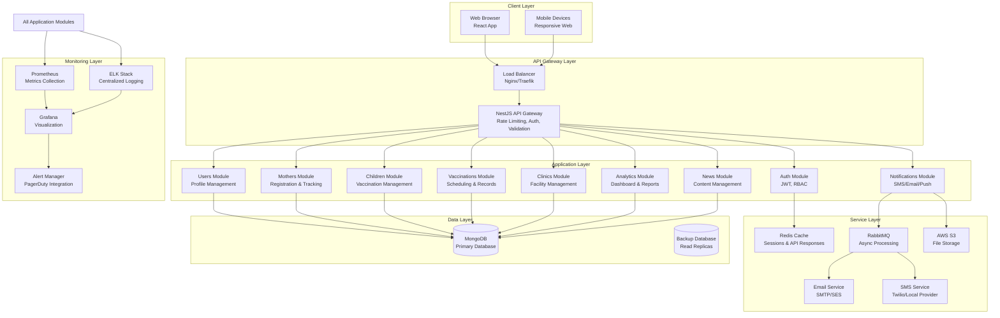
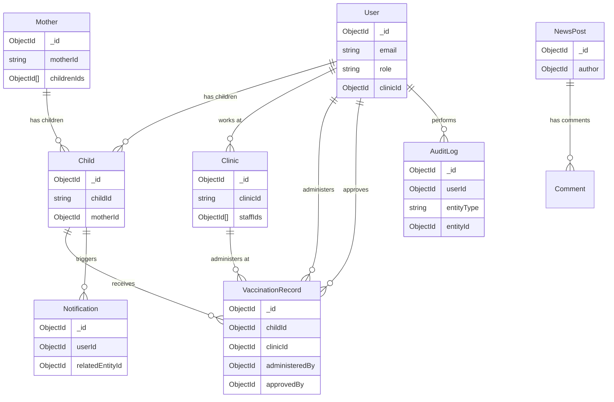

# Design Document: Infant Vaccination Management System Migration

## Overview

This document outlines the comprehensive design for migrating the existing PHP/MySQL-based Infant Vaccination Management System to a modern technology stack (NestJS + MongoDB + React). The migration aims to preserve all existing functionality while adding significant new features, improving scalability, enhancing security, and providing a better user experience for healthcare workers and parents in Ethiopia.

### Project Context
The current system is a PHP/MySQL application that manages vaccination records for mothers and children, includes user management, and provides a news/posts system. The migration will modernize the architecture to support growing user bases, improve reliability in areas with intermittent connectivity, and add critical clinical features for healthcare providers.

### Key Design Goals
1. **Preservation**: Maintain 100% of existing functionality with data migration integrity
2. **Modernization**: Implement modern development practices and technologies
3. **Scalability**: Design for 10,000 concurrent users and 5 million vaccination records
4. **Resilience**: Support offline functionality for rural areas with poor connectivity
5. **Security**: Implement HIPAA-equivalent data protection for sensitive health information
6. **Usability**: Provide intuitive interfaces for both technical and non-technical users

### Technology Stack
- **Backend**: NestJS with TypeScript, Domain-Driven Design architecture
- **Database**: MongoDB with Mongoose ODM
- **Frontend**: React with TypeScript, Material-UI components
- **State Management**: Redux Toolkit
- **Caching**: Redis for session and API response caching
- **Message Queue**: RabbitMQ for asynchronous processing
- **File Storage**: AWS S3 with CDN distribution
- **Monitoring**: Prometheus/Grafana for metrics, ELK stack for logging
- **Deployment**: Docker containers, Kubernetes orchestration, CI/CD pipelines

## Architecture

### System Architecture Diagram



### Domain-Driven Design Structure

The system follows Domain-Driven Design principles with the following bounded contexts:

1. **Identity & Access Context**: User authentication, authorization, role management
2. **Patient Management Context**: Mother and child registration, medical profiles
3. **Vaccination Context**: Vaccine administration, scheduling, tracking
4. **Clinical Context**: Doctor oversight, medical approvals, contraindications
5. **Facility Context**: Clinic/hospital management, location services
6. **Communication Context**: Notifications, news, announcements
7. **Analytics Context**: Reporting, dashboards, data visualization
8. **System Context**: Utilities, configuration, maintenance

### Deployment Architecture

```mermaid
graph TB
    subgraph "Development Environment"
        DevGit[Git Repository<br/>Feature Branches]
        DevCI[CI Pipeline<br/>Automated Tests]
        DevK8s[Kubernetes Dev<br/>Namespace Isolation]
        DevDB[MongoDB Dev<br/>Test Data]
    end
    
    subgraph "Staging Environment"
        StageGit[Main Branch<br/>Merge Validation]
        StageCI[Staging Pipeline<br/>Integration Tests]
        StageK8s[Kubernetes Staging<br/>Production-like]
        StageDB[MongoDB Staging<br/>Anonymized Data]
    end
    
    subgraph "Production Environment"
        ProdK8s[Kubernetes Production<br/>Auto-scaling]
        ProdDB[(MongoDB Atlas<br/>Sharded Cluster)]
        ProdCache[Redis Cluster<br/>High Availability]
        ProdQueue[RabbitMQ Cluster<br/>Mirrored Queues]
        ProdCDN[CloudFront CDN<br/>Global Distribution]
        ProdS3[S3 Buckets<br/>Multi-region Replication]
    end
    
    subgraph "Monitoring & Operations"
        ProdMonitor[Prometheus Stack<br/>Multi-cluster]
        ProdLogs[ELK Stack<br/>Centralized Logging]
        ProdAlerts[Alerting System<br/>Multi-channel]
        ProdBackup[Backup System<br/>Automated Recovery]
    end
    
    DevGit --> DevCI --> DevK8s --> DevDB
    StageGit --> StageCI --> StageK8s --> StageDB
    ProdK8s --> ProdDB
    ProdK8s --> ProdCache
    ProdK8s --> ProdQueue
    ProdK8s --> ProdCDN
    ProdK8s --> ProdS3
    
    ProdK8s --> ProdMonitor
    ProdK8s --> ProdLogs
    ProdMonitor --> ProdAlerts
    ProdDB --> ProdBackup
```



## Components and Interfaces

### Backend Modules (NestJS)

#### 1. Auth Module
- **Responsibilities**: Authentication, authorization, session management
- **Key Components**:
  - `AuthController`: Login, logout, token refresh endpoints
  - `AuthService`: JWT generation/validation, password hashing
  - `JwtStrategy`: Passport.js JWT strategy
  - `RolesGuard`: Role-based access control guard
  - `SessionService`: Session management and timeout enforcement
- **Interfaces**:
  - `LoginDto`: { email: string, password: string }
  - `AuthResponseDto`: { accessToken: string, refreshToken: string, user: UserProfileDto }
  - `TokenPayload`: { userId: string, role: UserRole, exp: number }

#### 2. Users Module
- **Responsibilities**: User management, profiles, role assignment
- **Key Components**:
  - `UsersController`: CRUD operations for users
  - `UsersService`: Business logic for user management
  - `UserProfileService`: Profile updates and validation
  - `PasswordService`: Password change and reset functionality
- **Interfaces**:
  - `CreateUserDto`: { email: string, password: string, role: UserRole, ...profile }
  - `UpdateUserDto`: Partial user updates
  - `UserProfileDto`: Complete user profile with role-specific data

#### 3. Mothers Module
- **Responsibilities**: Mother registration, profile management, maternal vaccination tracking
- **Key Components**:
  - `MothersController`: Mother CRUD operations
  - `MothersService`: Business logic for mother management
  - `MotherVaccinationService`: TT vaccine tracking
  - `MotherSearchService`: Advanced search and filtering
- **Interfaces**:
  - `CreateMotherDto`: { firstName: string, middleName?: string, lastName: string, birthDate: Date, ... }
  - `MotherVaccinationDto`: { vaccineType: TTVaccineType, dateAdministered: Date, ... }
  - `MotherSearchDto`: Search criteria with pagination

#### 4. Children Module
- **Responsibilities**: Child registration, vaccination scheduling, record management
- **Key Components**:
  - `ChildrenController`: Child CRUD operations
  - `ChildrenService`: Business logic for child management
  - `ChildVaccinationService`: R vaccine administration tracking
  - `VaccinationScheduleService`: Automated schedule generation
- **Interfaces**:
  - `CreateChildDto`: { firstName: string, motherId: string, birthDate: Date, ... }
  - `VaccinationRecordDto`: { vaccineType: RVaccineType, dateAdministered: Date, batchNumber: string, ... }
  - `VaccinationScheduleDto`: Upcoming and past vaccinations

#### 5. Vaccinations Module
- **Responsibilities**: Vaccine administration, scheduling, reminder system
- **Key Components**:
  - `VaccinationsController`: Vaccination recording endpoints
  - `VaccinationService`: Core vaccination logic
  - `ScheduleGeneratorService`: Automated schedule calculation
  - `ReminderService`: Notification scheduling
- **Interfaces**:
  - `AdministerVaccineDto`: { childId: string, vaccineType: VaccineType, ... }
  - `VaccinationScheduleRequestDto`: Schedule generation parameters
  - `ReminderSettingsDto`: User notification preferences

#### 6. Clinics Module
- **Responsibilities**: Healthcare facility management, location services
- **Key Components**:
  - `ClinicsController`: Clinic CRUD operations
  - `ClinicsService`: Business logic for clinic management
  - `LocationService`: Geospatial queries and distance calculations
  - `ClinicAssignmentService`: Staff-to-clinic assignment
- **Interfaces**:
  - `CreateClinicDto`: { name: string, address: ClinicAddressDto, ... }
  - `ClinicSearchDto`: Location-based search criteria
  - `ClinicStaffDto`: Staff assignment records

#### 7. Analytics Module
- **Responsibilities**: Data analysis, reporting, dashboard generation
- **Key Components**:
  - `AnalyticsController`: Report generation endpoints
  - `AnalyticsService`: Data aggregation and analysis
  - `ReportGeneratorService`: PDF/Excel report creation
  - `DashboardService`: Real-time dashboard data
- **Interfaces**:
  - `AnalyticsQueryDto`: Date range, filters, aggregation level
  - `ReportRequestDto`: Report type, format, delivery method
  - `DashboardDataDto`: Aggregated metrics for visualization

#### 8. Notifications Module
- **Responsibilities**: Multi-channel notifications, reminder system
- **Key Components**:
  - `NotificationsController`: Notification management
  - `NotificationService`: Core notification logic
  - `SmsService`: SMS gateway integration
  - `EmailService`: Email delivery
  - `PushService`: Mobile push notifications
- **Interfaces**:
  - `NotificationDto`: { type: NotificationType, recipient: string, content: NotificationContentDto, ... }
  - `NotificationPreferenceDto`: User channel preferences
  - `NotificationLogDto`: Delivery status and history

#### 9. News Module
- **Responsibilities**: Content management, news posting, article publishing
- **Key Components**:
  - `NewsController`: News CRUD operations
  - `NewsService`: Content management logic
  - `ContentParserService`: Content validation and parsing
  - `ImageService`: Image upload and processing
- **Interfaces**:
  - `CreatePostDto`: { title: string, category: string, content: string, images: File[] }
  - `PostResponseDto`: Formatted post with metadata
  - `ContentValidationResult`: Parsing and validation results

#### 10. Doctor Module
- **Responsibilities**: Clinical oversight, medical approvals, contraindication management
- **Key Components**:
  - `DoctorController`: Clinical function endpoints
  - `MedicalReviewService`: Patient history review
  - `ApprovalService`: Vaccination approval workflow
  - `ContraindicationService`: Medical contraindication tracking
  - `AdverseReactionService`: Adverse event monitoring
- **Interfaces**:
  - `MedicalReviewDto`: Patient assessment data
  - `ApprovalRequestDto`: Vaccination approval request
  - `ContraindicationDto`: Medical restriction details
  - `AdverseReactionDto`: Vaccine reaction documentation

### Frontend Components (React)

#### 1. Layout Components
- `AppLayout`: Main application layout with navigation
- `SidebarNavigation`: Role-based navigation menu
- `Header`: User info and quick actions
- `Footer`: System info and links

#### 2. Authentication Components
- `LoginForm`: User authentication interface
- `PasswordReset`: Password recovery flow
- `SessionTimeout`: Inactivity warning and handling

#### 3. Dashboard Components
- `AdminDashboard`: System overview for administrators
- `HealthcareDashboard`: Clinical overview for nurses/doctors
- `ParentDashboard`: Child vaccination status for parents
- `MetricsWidget`: Reusable metric display components

#### 4. Patient Management Components
- `MotherRegistration`: Mother registration form
- `ChildRegistration`: Child registration form
- `PatientSearch`: Advanced patient search interface
- `PatientProfile`: Comprehensive patient profile view

#### 5. Vaccination Components
- `VaccinationScheduler`: Interactive vaccination schedule
- `VaccinationRecorder`: Vaccine administration interface
- `VaccinationHistory`: Historical vaccination records
- `DigitalCardGenerator`: Digital vaccination card creation

#### 6. Clinical Components
- `MedicalReview`: Doctor review interface
- `ApprovalWorkflow`: Vaccination approval process
- `ContraindicationManager`: Medical restriction management
- `AdverseReactionTracker`: Reaction monitoring and reporting

#### 7. Reporting Components
- `ReportGenerator`: Custom report creation
- `AnalyticsDashboard`: Interactive data visualization
- `ExportManager`: Data export interface
- `ChartComponents`: Reusable chart library

#### 8. System Components
- `SettingsPanel`: User and system settings
- `NotificationCenter`: Notification management
- `OfflineIndicator`: Connectivity status display
- `SyncManager`: Offline data synchronization

### External Service Interfaces

#### 1. SMS Gateway Interface
- **Provider**: Twilio or local Ethiopian SMS provider
- **Interface**: REST API with rate limiting
- **Payload**: { to: string, body: string, from?: string }
- **Response**: { sid: string, status: string, error?: string }

#### 2. Email Service Interface
- **Provider**: AWS SES or SMTP server
- **Interface**: SMTP or REST API
- **Payload**: { to: string[], subject: string, html: string, text: string }
- **Response**: { messageId: string, status: string }

#### 3. File Storage Interface
- **Provider**: AWS S3
- **Interface**: AWS SDK with presigned URLs
- **Operations**: Upload, download, delete, list
- **Security**: Bucket policies, CORS configuration

#### 4. Payment Gateway Interface
- **Provider**: Local Ethiopian payment provider
- **Interface**: REST API with webhooks
- **Operations**: Payment initiation, status check, refund
- **Security**: API keys, request signing

## Data Models

### MongoDB Collections Design

#### 1. Users Collection
```typescript
interface User {
  _id: ObjectId;
  email: string;
  passwordHash: string;
  role: 'admin' | 'nurse' | 'doctor' | 'parent';
  profile: {
    firstName: string;
    middleName?: string;
    lastName: string;
    phoneNumber: string;
    photoUrl?: string;
    birthDate?: Date;
  };
  clinicId?: ObjectId; // For healthcare workers
  childrenIds: ObjectId[]; // For parents
  settings: {
    notifications: {
      email: boolean;
      sms: boolean;
      push: boolean;
    };
    language: string;
    timezone: string;
  };
  security: {
    lastLogin: Date;
    failedAttempts: number;
    lockedUntil?: Date;
    mfaEnabled: boolean;
  };
  audit: {
    createdAt: Date;
    updatedAt: Date;
    createdBy?: ObjectId;
    updatedBy?: ObjectId;
  };
  isActive: boolean;
}

// Indexes:
// { email: 1 } - unique
// { role: 1 }
// { clinicId: 1 }
// { 'profile.phoneNumber': 1 }
```

#### 2. Mothers Collection
```typescript
interface Mother {
  _id: ObjectId;
  motherId: string; // Unique human-readable ID
  personalInfo: {
    firstName: string;
    middleName?: string;
    lastName: string;
    birthDate: Date;
    bloodType: 'A+' | 'A-' | 'B+' | 'B-' | 'AB+' | 'AB-' | 'O+' | 'O-';
    photoUrl?: string;
  };
  contactInfo: {
    phoneNumber: string;
    alternatePhone?: string;
    email?: string;
  };
  address: {
    zone: string;
    wereda: string;
    kebele: string;
    houseNumber?: string;
    gpsCoordinates?: {
      lat: number;
      lng: number;
    };
  };
  vaccinations: {
    tt1: { administered: boolean; date?: Date; administeredBy?: ObjectId };
    tt2: { administered: boolean; date?: Date; administeredBy?: ObjectId };
    tt3: { administered: boolean; date?: Date; administeredBy?: ObjectId };
    tt4: { administered: boolean; date?: Date; administeredBy?: ObjectId };
    tt5: { administered: boolean; date?: Date; administeredBy?: ObjectId };
    rh: { administered: boolean; date?: Date; administeredBy?: ObjectId };
  };
  medicalHistory: {
    allergies: string[];
    chronicConditions: string[];
    previousAdverseReactions: string[];
    notes: string;
  };
  childrenIds: ObjectId[];
  audit: {
    createdAt: Date;
    updatedAt: Date;
    createdBy: ObjectId;
    updatedBy?: ObjectId;
  };
  isActive: boolean;
}

// Indexes:
// { motherId: 1 } - unique
// { 'personalInfo.phoneNumber': 1 }
// { 'address.zone': 1, 'address.wereda': 1, 'address.kebele': 1 }
// { childrenIds: 1 }
```

#### 3. Children Collection
```typescript
interface Child {
  _id: ObjectId;
  childId: string; // Unique human-readable ID
  motherId: ObjectId;
  personalInfo: {
    firstName: string;
    middleName?: string;
    lastName: string;
    birthDate: Date;
    bloodType: 'A+' | 'A-' | 'B+' | 'B-' | 'AB+' | 'AB-' | 'O+' | 'O-';
    photoUrl?: string;
  };
  vaccinations: {
    r1: {
      scheduledDate: Date;
      administered: boolean;
      dateAdministered?: Date;
      batchNumber?: string;
      administeredBy?: ObjectId;
      clinicId?: ObjectId;
      approvedBy?: ObjectId; // Doctor approval
    };
    r2: { /* same structure as r1 */ };
    r3: { /* same structure as r1 */ };
    r4: { /* same structure as r1 */ };
    r5: { /* same structure as r1 */ };
  };
  medicalInfo: {
    birthWeight: number;
    birthHeight: number;
    allergies: string[];
    contraindications: {
      type: string;
      reason: string;
      flaggedBy: ObjectId;
      dateFlagged: Date;
      isActive: boolean;
    }[];
    adverseReactions: {
      vaccineType: string;
      reaction: string;
      severity: 'mild' | 'moderate' | 'severe';
      dateReported: Date;
      reportedBy: ObjectId;
      treatment?: string;
    }[];
  };
  digitalCard: {
    qrCode: string;
    lastGenerated: Date;
    version: number;
    shareToken?: string;
  };
  audit: {
    createdAt: Date;
    updatedAt: Date;
    createdBy: ObjectId;
    updatedBy?: ObjectId;
  };
  isActive: boolean;
}

// Indexes:
// { childId: 1 } - unique
// { motherId: 1 }
// { 'personalInfo.birthDate': 1 }
// { 'vaccinations.r1.scheduledDate': 1 }
// { 'vaccinations.r1.administered': 1 }
// { 'medicalInfo.contraindications.isActive': 1 }
```

#### 4. Clinics Collection
```typescript
interface Clinic {
  _id: ObjectId;
  clinicId: string; // Unique identifier
  name: string;
  type: 'hospital' | 'health_center' | 'clinic' | 'health_post';
  contactInfo: {
    phone: string;
    email?: string;
    emergencyContact?: string;
  };
  address: {
    zone: string;
    wereda: string;
    kebele: string;
    street?: string;
    building?: string;
    gpsCoordinates: {
      lat: number;
      lng: number;
    };
  };
  facilities: {
    hasColdStorage: boolean;
    hasGenerator: boolean;
    hasInternet: boolean;
    capacity: number; // Daily vaccination capacity
  };
  staff: {
    doctorIds: ObjectId[];
    nurseIds: ObjectId[];
    adminIds: ObjectId[];
  };
  inventory: {
    vaccineTypes: string[];
    lastRestocked: Date;
    currentStock: Map<string, number>; // vaccineType -> quantity
  };
  operatingHours: {
    monday: { open: string; close: string };
    tuesday: { open: string; close: string };
    wednesday: { open: string; close: string };
    thursday: { open: string; close: string };
    friday: { open: string; close: string };
    saturday: { open: string; close: string };
    sunday: { open: string; close: string };
  };
  audit: {
    createdAt: Date;
    updatedAt: Date;
    createdBy: ObjectId;
    updatedBy?: ObjectId;
  };
  isActive: boolean;
}

// Indexes:
// { clinicId: 1 } - unique
// { 'address.gpsCoordinates': '2dsphere' }
// { 'address.zone': 1, 'address.wereda': 1 }
// { type: 1 }
// { 'facilities.hasColdStorage': 1 }
```

#### 5. Vaccination Records Collection
```typescript
interface VaccinationRecord {
  _id: ObjectId;
  recordId: string; // Unique record identifier
  childId: ObjectId;
  motherId: ObjectId;
  vaccineType: 'r1' | 'r2' | 'r3' | 'r4' | 'r5' | 'tt1' | 'tt2' | 'tt3' | 'tt4' | 'tt5' | 'rh';
  administration: {
    date: Date;
    batchNumber: string;
    administeredBy: ObjectId; // Nurse/doctor ID
    clinicId: ObjectId;
    doctorApproval?: {
      approvedBy: ObjectId;
      approvalDate: Date;
      notes?: string;
    };
  };
  medicalData: {
    weightAtVaccination?: number;
    heightAtVaccination?: number;
    temperature?: number;
    notes?: string;
  };
  followUp: {
    nextVaccinationDate?: Date;
    followUpRequired: boolean;
    followUpDate?: Date;
    followUpNotes?: string;
  };
  audit: {
    createdAt: Date;
    updatedAt: Date;
    createdBy: ObjectId;
    updatedBy?: ObjectId;
  };
}

// Indexes:
// { recordId: 1 } - unique
// { childId: 1, vaccineType: 1 }
// { motherId: 1 }
// { 'administration.date': 1 }
// { 'administration.clinicId': 1 }
// { 'administration.administeredBy': 1 }
// { 'followUp.nextVaccinationDate': 1 }
```

#### 6. Notifications Collection
```typescript
interface Notification {
  _id: ObjectId;
  notificationId: string;
  type: 'vaccination_reminder' | 'overdue_alert' | 'system_alert' | 'news_update';
  recipient: {
    userId?: ObjectId;
    phoneNumber?: string;
    email?: string;
    deviceToken?: string; // For push notifications
  };
  content: {
    title: string;
    body: string;
    data?: Record<string, any>; // Additional data for deep linking
  };
  delivery: {
    channels: ('sms' | 'email' | 'push')[];
    scheduledFor: Date;
    sentAt?: Date;
    status: 'pending' | 'sent' | 'failed' | 'delivered';
    failureReason?: string;
    retryCount: number;
    maxRetries: number;
  };
  metadata: {
    relatedEntityType?: 'child' | 'mother' | 'vaccination';
    relatedEntityId?: ObjectId;
    priority: 'low' | 'medium' | 'high' | 'critical';
  };
  audit: {
    createdAt: Date;
    updatedAt: Date;
  };
}

// Indexes:
// { notificationId: 1 } - unique
// { 'recipient.userId': 1 }
// { 'delivery.scheduledFor': 1 }
// { 'delivery.status': 1 }
// { 'metadata.priority': 1 }
// { 'metadata.relatedEntityId': 1 }
```

#### 7. News Posts Collection
```typescript
interface NewsPost {
  _id: ObjectId;
  postId: string;
  title: string;
  category: 'vaccination' | 'health_tips' | 'news' | 'announcement' | 'education';
  content: {
    summary: string;
    fullText: string;
    htmlContent: string; // Sanitized HTML
  };
  media: {
    images: {
      url: string;
      caption?: string;
      altText: string;
      order: number;
    }[];
    featuredImage: string; // URL to featured image
  };
  metadata: {
    author: ObjectId;
    tags: string[];
    language: string; // 'am' for Amharic, 'en' for English
    readTime: number; // Estimated reading time in minutes
  };
  visibility: {
    isPublished: boolean;
    publishDate: Date;
    expiryDate?: Date;
    targetAudience: ('all' | 'parents' | 'healthcare' | 'doctors')[];
  };
  engagement: {
    views: number;
    shares: number;
    likes: number;
    comments: Comment[];
  };
  audit: {
    createdAt: Date;
    updatedAt: Date;
    createdBy: ObjectId;
    updatedBy?: ObjectId;
  };
}

// Indexes:
// { postId: 1 } - unique
// { category: 1 }
// { 'visibility.publishDate': 1 }
// { 'visibility.isPublished': 1 }
// { 'metadata.language': 1 }
// { 'metadata.tags': 1 }
```

#### 8. Audit Log Collection
```typescript
interface AuditLog {
  _id: ObjectId;
  timestamp: Date;
  userId: ObjectId;
  userRole: string;
  action: string;
  entityType: string;
  entityId?: ObjectId;
  changes: {
    field: string;
    oldValue?: any;
    newValue?: any;
  }[];
  ipAddress: string;
  userAgent: string;
  location?: {
    country?: string;
    region?: string;
    city?: string;
  };
  outcome: 'success' | 'failure';
  error?: {
    code: string;
    message: string;
    stack?: string;
  };
  metadata: Record<string, any>;
}

// Indexes:
// { timestamp: 1 }
// { userId: 1 }
// { action: 1 }
// { entityType: 1, entityId: 1 }
// { outcome: 1 }
// { 'location.country': 1 }
```

### Data Relationships



### Data Migration Strategy

#### Phase 1: Schema Analysis and Mapping
1. Analyze existing MySQL database structure
2. Map MySQL tables to MongoDB collections
3. Design data transformation rules
4. Create migration scripts for each entity type

#### Phase 2: Data Extraction
1. Export MySQL data in batches
2. Validate data integrity before migration
3. Handle data inconsistencies and missing values
4. Create backup of original data

#### Phase 3: Data Transformation
1. Transform relational data to document structure
2. Apply business rules and data enrichment
3. Generate unique IDs for new collections
4. Establish relationships between documents

#### Phase 4: Data Loading
1. Load data into MongoDB in controlled batches
2. Implement retry logic for failed batches
3. Monitor progress and performance
4. Validate loaded data against source

#### Phase 5: Verification and Rollback
1. Compare record counts between systems
2. Validate data relationships and integrity
3. Test critical business functions
4. Prepare rollback plan if issues detected

#### Migration Script Example:
```typescript
// Example migration script for mothers table
async function migrateMothers(mysqlPool, mongoCollection) {
  const batchSize = 1000;
  let offset = 0;
  let migratedCount = 0;
  
  while (true) {
    const mothers = await mysqlPool.query(
      `SELECT * FROM mothers LIMIT ? OFFSET ?`,
      [batchSize, offset]
    );
    
    if (mothers.length === 0) break;
    
    const transformedMothers = mothers.map(mother => ({
      motherId: `M${mother.id.toString().padStart(8, '0')}`,
      personalInfo: {
        firstName: mother.first_name,
        middleName: mother.middle_name || null,
        lastName: mother.last_name,
        birthDate: new Date(mother.birth_date),
        bloodType: mother.blood_type,
        photoUrl: mother.photo_path ? `/images/mother/${mother.photo_path}` : null
      },
      contactInfo: {
        phoneNumber: mother.phone_number,
        alternatePhone: mother.alternate_phone || null,
        email: mother.email || null
      },
      address: {
        zone: mother.zone,
        wereda: mother.wereda,
        kebele: mother.kebele,
        houseNumber: mother.house_number || null
      },
      vaccinations: {
        tt1: { administered: mother.tt1_administered === 1, date: mother.tt1_date },
        tt2: { administered: mother.tt2_administered === 1, date: mother.tt2_date },
        tt3: { administered: mother.tt3_administered === 1, date: mother.tt3_date },
        tt4: { administered: mother.tt4_administered === 1, date: mother.tt4_date },
        tt5: { administered: mother.tt5_administered === 1, date: mother.tt5_date },
        rh: { administered: mother.rh_administered === 1, date: mother.rh_date }
      },
      childrenIds: [], // Will be populated from children migration
      audit: {
        createdAt: new Date(mother.created_at),
        updatedAt: new Date(mother.updated_at),
        createdBy: null, // Will map from users table
        updatedBy: null
      },
      isActive: mother.is_active === 1
    }));
    
    await mongoCollection.insertMany(transformedMothers);
    migratedCount += mothers.length;
    offset += batchSize;
    
    console.log(`Migrated ${migratedCount} mothers...`);
  }
  
  return migratedCount;
}
```